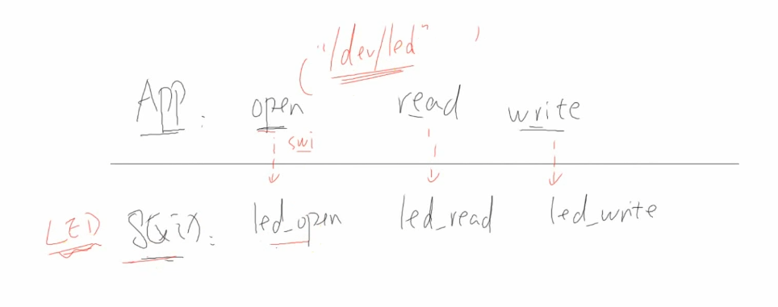

# Linux应用程序和驱动

### APP与硬件界限

单片机：APP与硬件之间没有明确的界限，APP与驱动程序也没有明确的界限，可以说是没有驱动程序，都是直接调用完成，APP可以直接操作硬件寄存器来实现相关硬件操作。

Linux：APP与硬件直接有非常明确的界限；APP无法直接对寄存器操作来实现对硬件的操作。APP属于用户态，只能通过驱动程序，来对硬件进行操作。驱动程序有更高、更多的权限进行处理。

### Linux下应用程序调用驱动程序

应用程序必须使用标准的接口：open、read、write   

调用接口，触发一个异常，即一个**swi异常**。swi是一个汇编指令。调用内核的swi异常处理函数，去调用sys_open等，从用户态跳转至驱动态(内核态  名字不清楚)。怎么判断是open还是什么指令。是再应用程序调用open或其他接口时，设置r0寄存器的值。触发异常后，cpu判断值即可确定。

**驱动 = 框架 + 硬件操作**

**整个流程**

### 字符设备驱动程序框架

**APP怎么找驱动？**

应用程序中，open打开文件。并不在乎其文件名是什么在什么目录下。在乎的是文件的属性(类别)。在sys_open中判断是否是普通文件还是特殊文件。如果是一个特殊文件，是一个字符设备节点。就要找到一个字符设备的驱动程序，找到哪一个字符设备驱动程序，根据主设备号来找。

暂且认为内核里面有一个数组，这个数组字符设备数组**chrdevs**，sys_open发现是字符设备节点，就回去字符设备数组中查找，找哪一项，找主设备号这一项，chrdevs[主设备号]。

**怎么写驱动程序？**

写驱动程序，是为了填充chrdevs[n]数组中的某一项。这个驱动程序要放到数组里面去。

1.确定主设备号n，n可以设置成一个空闲设备；也可以设置为0，设为0时就系统帮你找到哪一项时空闲的。

2.构造结构体  file_operations ,需要什么构造什么。

3.注册：所谓注册就是把某个结构体，放入某个数组，或某个链表里去；

第一个参数，是主设备号，设为0的话，就返回一个系统选择的主设备号。

4.入口：对于上面的注册什么时候来注册，谁来调用这个注册函数；入口来调用

运用module_init()函数来修饰普通的hello_init函数，让其成为一个入口函数；

展开module_init；可以知道入口函数永远都是init_module，如果你不用module_init修饰的话；

5.出口：unregister_chrdev

#### 补充

次设备号：

1.驱动程序，register_chrdev(100，，),注册设备节点，用的是100主设备号；

2.应用程序去open的时候，可能open不同的节点，如下；这两个节点主设备号一样，次设备号不一样

3.假设APP调用**write**函数，write函数就会进入内核，进入到**led_write**;进行判断

由此可见次设备号的函数，完全由驱动程序来决定；  主设备号是让来让应用程序找到驱动程序，次设备号含义由编程人员来决定。

module_init:

### 数据流程

应用程序：read(fd, buf, len)  write(fd, buf, len)

驱动程序能不能直接使用这个buf？  不可以，不可以直接访问，两个地址空间不同；

只能运用copy_to_user,copy_from_user函数

在驱动之下就是硬件；在驱动程序里面能不能直接访问下图中addr这个地址？也不行。驱动程序不能访问这个地址，这个地址是一个物理地址，驱动程序里面使用的是虚拟地址。他得调用一个函数ioremap，映射一段物理地址地址，得到一个虚拟地址v，这样才可以在驱动程序里面使用这个虚拟地址来访问硬件

### 出入口细讲

__init这个宏，被定义成下面这样；他有一个段属性，段属性为**.init.text**，意思就为这个函数的代码会放在这一段内，用完后会释放掉。

入口：只用一次，可释放。

出口：只有在最后才能释放，在整个过程中都一直存在。

在内核里面我们用printk，这个打印信息会先存入内核的一个buf里面，这个buf很大，有几k，十几k。然后通过串口或屏幕显示出来。用不要使用串口和屏幕可以选择，但一定会存在与buf里面。我们可以使用**dmesg**命令来查看。

**cat  /proc/devices **查看主设备号

创建设备节点 **sudo mknod /dev/jyl c 240 0**

### 地址空间

 

​	这个不重要只是笔记，**a = strtol(argv[1], NULL, 0);**其中strtol可以看成str  to long 将一个字符串转换成一个long。

同一时间同一地址，为什么他的值不一样？

引入虚拟地址概念！

**单片机**：CPU发出地址给**内存控制器**，内存控制器发现是在A-B地址上，就会发出一个**片选引脚(cs n**)指向特定模块地址，当没有被选中时，就像不存在一样，不会干扰。

能够运行**linux芯片**：驱动程序在CPU上运行，通过虚拟地址发给MMU（内存管理单元），然后地址映射物理地址，再片选到各个硬件模块。

虚拟地址如何映射到物理地址呢？物理地址可以通过阅读芯片手册知道，那虚拟地址呢？运用**ioremap**映射，**ioremap(phy, len)**;

一个程序运行多次

1.main函数调用f1要用到f1的addr

2.链接时，要确定f1的addr

3.运行时，f1所在内存可能不一样

1、2中addr是虚拟地址viirtual，3是物理地址。

**引入虚拟地址后我们如何运行程序？**

1.内核首先要去加载程序，放入某个内存物理地址addr_phy1

2.映射：链接地址（虚拟地址）映射到这个物理地址addr_phy1

3.运行：跳到虚拟地址去运行

### 驱动程序的辅助信息

装载驱动时，自动创建设备节点。

**创建类**：**class_create();** 在/sys/class/hello_class创建这样一个子目录；创建类

**class_destroy();**

**创建设备节点**：**device_create**(class_for_hello, NULL, MKDEV(major, 0), NULL, "myhello"); /* /dev/myhello */

**device_destroy**(class_for_hello, MKDEV(major, 0));

### 在内核目录里编译驱动

在内核外编译Makefile：

**obj-y** 编译进内核 **obj-m**编译为模块 也可以**不设置**，不会编译完全不去管。

这个变量在哪里被设置？**内核根目录的.config文件**

.config如何生成？ 执行下面命令时，复制为.config

能否修改这个.config？可以修改，**make menuconfig**,得到下面这个界面。

圈中那些哪来的？ 来自于内核目录的各各**Kconfig**

更改  drivers/char/Kconfig文件 

make menuconfig

如图配置变量类型是**布尔变量**,要么y要么n，现在被设置成y。

**location**：在设备驱动下，在字符设备驱动下面；

**提示信息**：Prompt那句。

此处输入n就是不包含到内核里面去

后面设置为m

拷贝驱动程序进入内核目录，修改Makefile

如果config中配置为m的话，就可以执行make modules编译众多的模块。

如果上面make menuconfig设置为y的话就可以在内核目录执行

make zImage -j 16 或者 make uImage  编译内核映像文件

驱动程序编进了内核，得到了zImage

问题：

1.**POSIX接口**；什么open，read，write都是；这种接口的作用：对于一个APP运用这些标准的接口，同一套代码，在不同环境，内核下编译，就可以放到不同内核系统的单板上运行。可以说是提高移植性

APP：

linux->

rt-thread->

liteos-a->

2.**kmalloc** 在中断过程中能使用。

3.**次设备号再怎么传到驱动？** 当在内核中调用sys_open找到flash、磁盘文件，得到字符设备、主设备号、次设备号。得到的这些信息会保存在一个**inode结构体**。在驱动程序open函数里面调用 **iminor(inode)** 得到次设备号。在wirte函数里，运用下面的函数得到次设备号。

4.单片机链接地址是物理地址，因为单片机中没有虚拟地址的概念。

5.linux中有那种有mmu的设备，和no mmu的设备。有mmu的设备的链接地址就是虚拟地址。没有的就是物理地址。

6.**Kconfig：**提供界面内容；make menuconfig里面各个项哪来的，都由Kconfig提

供。

**.config：**保存配置值

**Makefile**：使用.config中的配置值

设置下面的变量

### 分离思想

怎么管理这些Driver、Device

管理方法就是，左边driver链在一起放入一个链表里面；右边device也链在一起放入一个链表里面。 这些链表放入，一个Bus结构体，总线结构体。Bus中有一个drv_list、dev_list。**总线设备驱动模型**

1.把模块拆为两部分：drv、dev

2.构造drv，注册

3.构造dev，注册

注册就是就两个结构体放入左右两边链表

4.匹配的话，执行某些函数

在linux系统里面已经有了一个总线结构体，叫做**platform_bus_type**结构体，这个结构体里面已经有了一个Driver链表和一个Device链表 。

怎么比较呢？就是看这个名字，**name相同**，就调用**probe**函数。在probe函数里面就是那些老一套，构造file_operations结构体，注册这个结构体**register_chrdev**。这样APP就能使用这个驱动程序了。

在两个文件的入口函数里面分别去注册**platform_driver**和**platform_device**.

### platform_driver platform_device万能膏药

1.platform_bus_type这是一个虚拟的总线,只是为了引入左右两边drv,dev,这样一个机制,它只是一个机制.

2.还有其他总线usb_bus / i2c_bus / spi_bus

左边platform_drv 右边platform_dev两个匹配后调用probe函数

如果多个dev注册了,那么drv的probe会被调用多次吗? 当然!

但如果有多个drv都可以支持一个dev,都是匹配的,只会调用probe一次.

一个drv可以支持多个dev;一个dev虽然匹配多个drv,但只调用一个drv的probe函数.

**例子**

在hello_dev.c里面platform_device结构体中.num_resources = 1,指定资源个数；.resource      = hello_dev_res,指定资源**数组**，上面定义resource资源结构体数组。里面就是一些硬件设备信息。里面地址实际操作中就可以填入一些类似gpio的地址等。

在hello_drv.c中，匹配成功就调用probe函数，函数参数，pdev指针，就可以获得设备资源信息。

**总线驱动模型分析实验**

装载ko文件，demsg查看得到。

它干什么了呢？注册了字符设备驱动程序，创建了类，注册了平台driver.

cat /proc/devices在内核里面查看信息

现在还没有设备节点，提供的辅助信息还不够，只是创建了类。

我们能不能查看这个类呢？可以的进入下图的目录就可以看见，有一个类目录。进入这个目录，ls一下发现现在什么都还没有。为什么呢？因为还没有在这个类下面创建device.

在入口函数里面还注册了一个**platform_driver**.

我们装载led_dev.ko，dmesg命令查看，入口函数，probe函数都被调用了。

同时设备节点也出现了。

再去class下看发现有了一个设备，进入，cat 一下dev发现主次设备号都有了

平台驱动里面就有了一个设备

### match方法

续接上面的实验。我们在**注册platform_device**的时候有一个**名字**

在这个目录下，一个目录对应一个**device**。之前在led_dev.c中硬件注册了一个名为100ask_led.0的目录或者说device。所以在第二次装载驱动程序led_dev2.ko时，注册时就需要名字不同，如果相同就会出错。

那这样不是和之前的match所说的通过name相同，进行匹配，一个drv可以匹配多个dev相冲突吗？

这就要深入这个**platform_bus_type**结构体里面研究其匹配方式。之前我们所用的是最简单的匹配方式，名字相同就行，但想要实现一个drv对应多个dev就不能使用单一的名字来匹配了。

那么怎么做呢？我们查看**platform_bus_type**结构体里面的**platform_match**得到如图。发现需要设置pdev里面的driver_override与drv->name进行匹配。

更改后装载查看

在**match**函数里面我们看到了**第一种**匹配方法

**第二种**方法，**设备树**如下

第三种方法，比较老

第四种方法，

第五种方法，也就是我们最开始使用的方法，直接比较名字

现在我们先来看看第四种方法，**id_table**;   id_table什么意思，我这个驱动程序能够支持什么设备，能够在这个id_table里面列出来。然后可以使用这个id_table和那些平台设备比较。  怎么写？

先定义一个id_table结构体，如下

id_table里面有什么如下。有名字(device设备名字)，有一个驱动数据(不知道是啥现在)

怎么比较呢？id_table里面每一项取出来，如果那一项有name的话，就会比较平台设备的name比较，如果成功就表明时匹配的。

在drv.c里面创建如下

### platform_device注册过程分析

这里有个pdev->id,它给你设置了一个**pdev->id** 这就是刚才为什么会出现在

/sys/..../**100ask_led.0**

注册一个dev时，会先把这个设备，放入总线的设备链表。然后去枚举这个设备；他怎么枚举？他会对于这个总线下的每一个drv(驱动)调用__device_attach_driver函数来判断他们，看看他们是否匹配。这函数是怎么一回事呢？

这是总线 枚举 设备

**__device_attach_driver函数**

方框中，首先判断，如果已经有驱动程序支持你了，就返回**错误**了，就不会往下运行了。如果一开始没有，就往下走。 就是说有组了也会去attach，对于每一个都会去执行这个函数，只是有驱动了就返回错误了，但是两个必定会执行这个函数，两两必定attatch.  (这是新注册dev去找drv)

**补充知识**

如图，这不是一个平台设备嘛！**pdev**它代表这一个硬件，一个**硬件资源，**一些硬件信息

我们可以在里面添加记录一些**私有数据**

就可以用这种函数，将信息保存进这个dev设备，以后就可以从这个私有数据里面取出保存的那一项信息

就如下图，就从那个dev私有数据里面取出那一项，得到那个次设备号。

### 设备树

#### 设备树的引入

以前每一个platform_device都对应一个dev.c使得代码臃肿、修改麻烦。

一切的源头都是这个platform_device 都是由 **.c** 生成和注册的。

如果有其他的办法来生产这个platform_device不就可以了吗！

以前这个 **.c** 要编译成ko或者编进内核，现在我用某一个**配置文件**，定义一个配置文件，以后根据配置文件来生成这个platform_device, 这样就可以了。当产品不一样的时候我们去修改这个配置文件就可以了。现在配置文件和内核不放一块了，**分开**。现在用一个配置文件，内核可以来**读取**这个配置文件，根据配置文件来生成platform_device。

#### 创建设备树节点

设置工具链，编译设备树

然后查看一下，这就是我所用的设备树。

这个**dtb文件**是编译好的设备树文件。是看不懂的，想知道他的原文件怎么写。我们就把这个文件反编译一下，运用**dtc命令**。

`dtc -I dtb -O dts 100ask_imx6ull-14x14.dtb > 1.dts`

-I 输入格式        -O输出格式

设备树的格式：

label 标号 可写可不写 注意写的话紧接着加冒号,之后有个空格

node-name 节点的名字

然后@ 中括号可写可不写

properties definitions 属性定义；怎么写属性定义呢？属性定义就是name = val;      name随便写，val呢？val就有很多种取值形式

child nodes 子节点

例：

上面是一个节点，下面也是一个节点，那么哪一些节点会被转换成平台设备呢？

在**根节点**下，有名为**compatible**这么一个属性的那些些子节点(根节点的子节点)，会被转换成**platform_device**。 对于这个属性，前面一般是公司名，后面是设备名。

现在修改好了设备树文件，去编译一下

将编译好的设备树文件，拷贝到单板的/boot目录重启。

base目录就相当于根目录

进入myled_for_test目录看一下，我们没有给他名字，他自动给我们添加了一个名字

其属性就和这个节点的名字是一样的，不加name就是节点的名字，当然可以自己来添加这个name的属性。

来看看另一个节点

去看看系统 总线 平台下 很多设备    ls加上**-d**是显示**文件名** 不是文件内容

可以看到他生成了一个平台设备节点  **platform_device**

总的来说，以前我们在 **.c** 里面实现这个**platform_device** ，现在在**设备树**就可以了。

那么问题就来了，现在有一个platform_driver 那么这个platform_driver和这个platform_device如何匹配？

#### 设备树节点匹配过程

 怎么去删除一个已有的节点

在设备树dtbs文件修改，语法如下：

例：

还有一种方式好像要放在节点里面。

还有一种方式，我们可以去禁用它。默认是ok。

在实验中发现这个name还必须跟上面的一样，但文档中显示这个属性值已经过时，一般不设置。

好了现在我们回想platform_match里面有**设备树的匹配方法**，之前我们先忽略了。OF什么意思呢？open firmware开放固件

查看函数，看到里面调用函数**of_match_device**,就是把dev和drv里面的**of_match_table**来做比较。他既然是个table(表格)就表明这个**平台驱动(drv)**可以支持多个设备。of_match_table其实也就是一个用来跟设备树比较的，有就说明这个drv支持这个设备树节点。

来看看如何写，我们在平台driver里面有一个driver里面有一个**of_match_table**所等于参数就是结构体,表示他能支持哪一些从设备树节点转换成的平台设备，顶一个**of_device_id**结构体放入所支持的设备的**compatible**属性值，最后要有个**空项**表示结束。跟设备树里面的定义的节点比较看看有没有。

实验中，装在驱动，发现调用到了probe函数，但还是出现错误。我们去代码里面看看。

这个函数是获得这个pdev的资源，但我们在设备树里面并没有给他什么资源，所以返回错误。查询错误正好是22. 实验还是成功的。

以前的代码里面，这个平台设备里面有资源。

我要去这里面获得资源

现在呢，我们的这个platform_device 是来自于设备树节点

我们没有给他指定什么资源，我们可以从这个pin属性里面来获得什么信息。

我们还可以去修改驱动程序，让这个驱动程序去判断一下这个**platform_device**是**普通的平台设备**还是来自于**设备树**。

怎么判断呢？probe函数里

红框中，是一个设备树函数 **of_property_read_string**读字符串,第一个参数，这个平台设备里面的dev里面的**of_node**设备树节点，第二个参数表述这个节点所表示属性的，属性名。第三个参数就是保存字符串的。

实验：这表示，在100ask_led这一平台driver下面有一个名为my_led_for_test_ok的设备，两两就匹配成功了。

我们可以执行dmesg命令来查看一下

节点也出来了

**再对比单片机驱动和Linux驱动**

Linux：先是为了给APP，引入file_operatons结构体；后来引入平台总线模型；再后来引入设备树。

问题：

1.Linux里面一份设备驱动能适配全世界所有的不同的SOC嘛？

可以的，比如led驱动程序，你只要在设备树里面指定用哪个引脚就可以了。因为linux里面有一个**GPIO子系统**。以后补充

2.创建设备节点很简单，但你想要它有意义，就必须让他的主设备号，等于某个去驱动的主设备号。

3.设备树里面，可以描述一些真实存在的信息，硬件；也可以描述一些虚拟的信息，如时钟。

4.在设备树增加节点后，在/sys/xxx什么目录下查看这个节点？

dts文件编译成dtb文件，然后内核启动它，进入这个目录查看；

某一个节点被转换成了**platform_device**，某一个节点他不是platform_device可能是**i2c_client**,某个节点可能被转换成了spi_dev，那怎么去查看某个节点呢？

platform_device:

i2c_client:

spi_dev:

我们有平台总线，i2c总线，spi总线；平台总线是一个虚拟的总线，i2c、spi是一个真实的总线

### 设备树示例

#### LED和按键的设备树示例(GPIO/ 门电路)

设备树不仅有硬件信息，还有软件信息；指定哪个引脚，高电平有效还是低电平有效；还可以定义按键值。

比如红外遥控器：就有引脚；还有一些协议，规范。每个红外对应不同。

我们来看看正规的led节点怎么写

首先来看看这个节点有什么呢？

**leds**表明他有多个led

有 **compatible** 根据这个来找到驱动程序。

有 **status** 状态

下面还有**子节点**，设备树里面有没有子节点完全是由驱动来决定的，或者说我设备树写成这样，你驱动程序就得去处理这些信息。

然后下面才是硬件信息，**gpios** ；里面用的哪组gpio用的gpio5中的第3个，然后还有一个标记**GPIO_ACTIVE_LOW**表示低电平有效，就意味着它输出低电平的时候这个灯亮。

下面还有其他信息，默认状态

除了硬件信息以外，其他信息，完全是由驱动程序决定的；比如驱动程序说想要让默认状态是on还是off，就必须提供这么一个值；还比如说驱动程序说想让它像心跳一样亮，就需要指定这样一项，不一定是这个值。

**led**

根据compatible 属性找驱动。

显然在这个节点下面有两个节点

这个就是硬件信息

#### I2C设备树

**原始的i2c1(芯片厂家提供)：**

**寄存器**地址，空间

中断，GIC的中断

时钟源

**产品决定**

引用了这个设备，所谓引用，就是可以去引用这个节点，然后在其增加更多的信息，或者去修改原来的信息。

上面有时钟源，这个时钟源输出多大的频率有产品决定

状态okay

对B的描述，就再引用某个i2c总线，在里面增加节点，填入设备信息。

对于A应当有一个驱动，对于B也应当有一个驱动。对于A是一个i2c控制器，这个驱动控制其首收发i2c数据。B，例子中是一个存储芯片,在其驱动程序里面应该实现，怎么去擦除芯片，怎么去读写芯片，读写数据。

**对于这个B，AT24C02**设备树怎么写：

必定位于某一条i2c总线之下

compatible找到驱动

 i2c**设备**地址，就是图上地址，从芯片手册上知道

#### SPI设备树

A:1.reg寄存器地址  2.intteraput中断  3.时钟源clock  4.compatible

B:1.cspin片选引脚  2.CLK  3.compatible

来看看怎么描述一个spi控制器，有寄存器地址reg，有中断interrupts，有时钟clocks，还有dma。(厂家做好) 来自于 **imx6ull.dtsi**  i表示被别人包含的，被谁包含呢？被单板相关的设备树包含,下图。

在单板相关的设备树里面，指定有引脚，有片选引脚cs-gpios。

对于下面的**spidev**，某一个spi设备

有一个compatible属性用来找到驱动程序；还有中断信息；还有spi最大频率；reg = 0应该表示我是这条spi总线下面的第0个spi设备；我对应的引脚对应的是cs-gpios这条属性下的第0个引脚

#### LCD设备树

怎么描述LCD，我们得知道硬件协议；

假设在LCD背后有一个电子枪，他会打出颜色。

当他打出颜色后，会移动到下一个像素；问题来了，我怎么移动？有个时钟DCLK，来一个时钟我就移动一个，来一个时钟我就移动一个。

移动到一行最后一个像素的时候，我们应该跳回下一行第一个像素；我怎么知道我已经移动到了最后，我怎么知道要开始跳回去了？有个行同步信息**HSYNC**

ok，现在我一行一行的打，最后一行都打完了，是不是要从右下角跳回到左上角。我怎么跳回去，我怎么知道我什么时候跳回去？有个垂直方向的水平信息**VSYNC**

问题来来了，我这个电子枪，要对某一个像素发出颜色。这个颜色来自于哪里？颜色来自于RGB三组线。

其他信息展示还是不重要

那我们怎么来描述这些信息；我们怎么来描述A：LCD控制器，怎么来描述B：LCD。

A:1.reg  2.clock  3.interrupts  4.其他信息

B:1.分辨率  2.PCLK 时钟频率，边沿，是下降沿去锁存数据，还是上升沿去锁存数据  

3.指定这个LCD **HSYNC** 是高有效还是低有效，还有其脉冲宽度  

4.**VSYND**是高有效还是低有效，脉冲宽度

#### 怎么写设备树

### Pinctrl

理想图：

  

根据设备状态设置引脚，i2c得有一个i2c驱动；iomux也得有个驱动，我们称之为pinctrl驱动。我们想使用i2c首先，需要通过pinctrl驱动把引脚配置为i2c功能。然后才能够去读写里面的寄存器。

设备树：

驱动程序中无需操作pinctrl

### GPIO

对于GPIO模块本身很多都已经把这个引脚复用功能iomux配置进去了。 

1.设置方向  2.设置值

某个设备怎么描述用到的GPIO？

红框中 gpio5是一个GPIO控制器或者说是模块 ，3是里面的哪个引脚，后面的GPIO_ACTIVE_LOW是flag这里表示说这个灯是低电平有效。

根据compatible找到驱动。reg寄存器的基地址。gpio-controller表示他是一个gpio控制器。 gpio-cells表示用几个cell(cell就是一个整数int)来描述一个引脚。在这个例子里面 3是一个cell  GPIO_ACTIVE_LOW也是一个cell。所以用到了两个cell来描述一个引脚。

### grep命令

grep "pinctrl_enet2" * -nwr 在所有文件查找这个字符串，整词查找，递归查找

grep "ENET2" * -nr | grep imx6ull 这个就是查询到的结果通过**管道**，打包结果传给下面，然后再在结果里面查找imx6ull。

###  LED和网卡设备树示例

#### LED：

1.GUI工具生成pinctrl信息，生成完后怎么用完全由自己决定，到时候你得把这些信息放入DTS

在一个图中的pinctrl所指代名字可能不同，查看第二图名字可能不一样，下面的信息是一样的

2.构造DTS的节点

你怎么知道这个设备结点的格式是这样的？

compatible你怎么知道这个属性是上面这个？是因为我们事先知道了内核里面有一些通用的led驱动程序，然后去看内核的文档，发现compatible属性是这个。

从原理图知道是gpio5_3  低电平有效

这个是每个灯的描述，你得指定gpio，指定默认状态，触发类型

#### 网卡：(对于复杂的接口/芯片自带的模块)

1.看原理图，根据引脚名字pin name搜DTS，就比如这个ENET2

2.确定pinctrl的名字这个例子中就是下图，pinctrl_enet2

可以看到下图配置了enet2接口的这些引脚，这些宏肯定也是来自于那个GUI工具

3.根据pinctrl的名字找结点

那怎么去引用这个引脚？

fec2这个节点也是厂家早就做好了的，但是这个节点里面并没有指定引脚信息，所以引用他，给你机会去修改他，添加pinctrl项来指定引脚信息

### 声卡设备树示例

1.先看原理图，确定引脚名字，SAI2

2.确定pinctrl名字

3.找到节点

### 应用程序和驱动程序的交互方式

原则：驱动只提供能力，不提供策略，策略由APP决定

及比如APP读数据，驱动程序中的drv_read是即可返回还是有数据返回。都可以实现，驱动提供能力，APP选择策略。

1.查询方法，就比如读数据，有数据就返回，没数据就返回一个错误

2.休眠唤醒，在open时传入flag ，驱动中判断flag然后对其执行不同策略

3.poll方式

可以看到这两个函数都可以指定一个超时时间

4.异步通知 约等于 中断

前面都是同步，就是会等；但这个就是异步，我们互不相干，醒了会主动告诉你。既然是异步通知的话，在驱动程序就不会由一个drv_fun。我们假设是有这样一个函数的。fun去调用drv_fun，那fun的数据就会等待drv_fun进行返回，这样又形成了同步。

APP：注册信号处理函数； 当有数据时会主动发信息给APP

#### 中断的处理及APP的关系

在这个图中模拟一个人看书被打断的情形；

过程是怎样的呢？

1。设置中断控制器；图中我们假设耳朵是中断控制器，耳朵对什么情况会做出反应，比如你听见门铃了会做出反应，但你听到水声并不会做出反应，所以设置中断控制器，就是这样一个作用。

2.注册中断处理函数；对于一些会产生中断的事件，比如上面例子中的门铃；我们听到门铃，会去开门然后拿快递。这里并不是让我们直接去做这样一个事，而是注册，让我们知道，假设发生了门铃。我们就来调用这个函数，完成函数中所定义的事件。

3.放书签； 就是保存现场，也就是保存当前正在处理的事件，去做这个中断。

4.开门，拿快递：就是发生了门铃中断，去调用2中所注册的函数。

5。继续看书；恢复现场 处理完中断后，回到中断发生处，取出保存的现场，继续执行。

上图中左边的这些，其实都是可以屏蔽的，就是可以设置，让其不发生中断，就比如，门铃；你不想去开，你不去就是了；但右边，是不可屏蔽的，称为**异常**。但是异常和中断他的处理流程是完全一样的。

#### 中断系统的设备树

怎么写驱动：**request_irq**

irq: 哪一个中断

handler:处理函数

name:名字 

dev:私有数据，在这个中断执行的时候，handler执行的时候，可以用到这个私有数据。

#### 中断驱动编写示例

把gpio转换成中断号，gpio比较特殊，有时候内核会有便利，会提供函数转换，所以设备树中没有写

现在我们更改设备树增加

对比上面的设备树，上面指定gpio，下面指定中断号

在编译更改后的设备树之前，我们要查找gpio5 1 ，我们去把他的状态设置为disabled，这样他就不会和我们增加的节点冲突了

现在我们编译更改后的设备树

装载驱动，按下按键

### 字符设备开发总结

内核里面驱动有一种思想叫做**面向对象**。你会看到很多的结构体。

1. 构造file_operations结构体

内核里面还有一个经常用的术语，叫做**注册**

2. register_chrdev

**数据传输**

我们的APP和驱动程序，是完全隔离开的，想要获得数据的话只有

copy_to_user  copy_from_user

驱动程序和硬件之间，驱动程序不能直接使用到这个硬件物理地址。只能通过一个虚拟地址，virt = ioremap(phy, reg_len); 把物理地址映射到虚拟地址。这个物理地址是从芯片手册得到的。

### 非阻塞方式流程分析

非阻塞方式打开

读成功的话就打印这个按键，失败的话打印-1

我们在应用程序open的时候，都会有flag，这个flag会被设置下来。

### 休眠唤醒方式流程分析

保存标记位flag；

APP读数据

以前如果是非阻塞的话，没有数据就即刻返回。

现在呢

wait_event等待事件，interruptible在等待过程中是可以被打断的。

看看这个函数

表示条件不成立的话就等待，条件成立的话就不等待。所以这句话的意思就是如果按键buf是空就等待。 所以如果为空他就在这个函数里面休眠了；

任务1 task1调用读函数，调用**wait_event**,他就放弃了运行，轮到别人运行task2、task3；在别人运行的过程中，我们按下了按键，按键处理函数被调用；

在处理函数里面我们去读gpio，**gpiod_get_value**;确定按键值，然后去唤醒，唤醒谁？之前在等待的时候会把自己放入下图的链表

我们唤醒的时候，在上图中断函数**gpio_key_isr**里面，去吧那些任务/线程唤醒

然后你并不一定可以立刻执行，可能仍然是task3，task2；反正最终总会轮到你执行

执行的时候就从之前那里继续运行

再上图可以看到，这段时间内，task1没有运行，没有浪费cpu资源；这种方式，效率更高，对整个系统更加友好

### poll机制流程分析

定个闹钟；

在定闹钟的时候，在打开文件的时候你**传入 O_NONBLOCK** 或者 **不传** 都**没有**任何影响

open完后它并不是马上去读，得调用poll函数

你需要去设置你要监测哪个驱动，fds是一个**pollfd**结构体.

fds[0].fd = fd;   表示你想监测哪个驱动；
fds[0].events = POLLIN;   表示你想监测什么事件，我想监测输入事件；poll(fds, 1, timeout_ms);  第二个参数就是指定fds数组有多少项；

先在poll了，驱动程序一定有一个poll函数和他对应

APP调用poll，会进入到内核调用sys_poll；这里面有个循环，他会去调用到驱动程序的poll；也就是会调用到上图的**gpio_key_drv_poll**,

首先他会把我们这个进程挂在这个**gpio_key_wait**队列上，然后这个gpio_key_drv_poll函数还会返回当前的状态；我们假设当前按键状态是空的，我们返回0；

第一次调用这个drv_poll的时候返回0

返回0的时候他不会马上return，就会导致运行到**5**，休眠一会；一会是多少，就是超时时间；

休眠过程中被唤醒，原因有两个，一个是闹钟响了，就是超时，内核来把他唤醒，再次来执行这个for循环，再次去调用驱动程序的poll，驱动程序的poll里仍然是0，返回仍然是0，没有按键数据，于是又执行下面的if，发现超时了，就返回一个错误**过程8**；

另一个是，中断程序来把他唤醒，假设还是上面的流程在休眠过程中，假设按下了按键，中断函数被调用，把数据放入key_buf里面去，然后去**gpio_key-wait**队列去唤醒，这个唤醒函数就会导致在**5**休眠一会处退出，退出后就会再次执行for循环，再次执行poll函数，发现有数据了，然后在**8**返回；

然后APP就可以根据poll函数返回的值，去读取得到的数据然后打印得到的数据或者打印timeout

### 异步通知机制流程分析

**发信号**

中断 -----  发信号  ---> APP

APP要干什么：1. 注册信号处理函数 2.做事

对于异步通知流程是 **第一步**APP去注册信号处理函数 **第二步**中断发信号 **第三步**APP会去调用到中断处理函数

对于发出的信号有很多种，所以得注册信号处理函数，就比如小孩和妈妈的场景，小孩叫妈妈有很多原因，对于不同原因妈妈应当采取不同方式

A. APP一开始，注册一个信号处理函数

B. 然后APP打开驱动程序

C. 接着APP去执行这些操作

**F_SETOWN** 把**getpid()** 这个pid(进程id)设置进驱动程序**fd**；这样以后驱动才知道把信号发给谁；**SETOWN**设置这个驱动程序(fd)的owner，你这个驱动程序是属于我的，属于谁？属于这个pid，属于某个进程。把 APP 的 PID(进程 ID)告诉驱动程序，这个调用**不涉及**驱动程序，在内核的**文件系统层次**记录 PID；    

**F_GETFL** 这是在干嘛呢？get flag，得到flag; 读取驱动程序文件 Flag；    

**F_SETFL** set flag设置flag，现在我得到了原来的flag，现在在原来的flag里面加上**FASYNC**；表示说设置这个flag，启动异步通知**功能**; 设置 Flag 里面的 FASYNC 位为 1: **当 FASYNC 位发生变化时，会导致驱动程序的 fasync 被调用；**    

D. 调用驱动程序的fasync函数

调 用 **faync_helper** ，它 会 根 据 FAYSNC 的 值 决 定 是 否 设 置 **button_async**->fa_file=驱动文件 filp；驱动文件 **filp 结构体**里面含有之前设置的 **PID**。    

E. 平时就在做其他的事情

F. 当按下按键后，会导致中断函数被调用

读取gpio，记录gpio；wake_up_interruptible(&gpio_key_wait);如果又任务在等待的话就唤醒任务；很显然在这个场景里面根本没有任务在等待；

但在这之后有一句话 **kill_fasync**(&button_fasync, SIGIO, POLL_IN);这句话就表示**发信号**；发什么信号？这个信号名为**SIGIO**；为什么发信号？**POLL_IN**，有数据可以读了(APP用不到这个参数)；发给谁？之前已经设置了owner。这个pid在哪？在这个**button_fasync**结构体里面；以后按下按键中断函数被调用，就发信息号给这个结构体，从这个结构体里面就知道了你咬发给哪个进程 / 哪个任务；

G. 平时就在做下面的函数

但当他收到上面的信号后，会**暂停**当前程序，然后**马上**去执行信号处理函数 **sig_func**，最后**恢复**当前程序

在大多数操作系统中，信号( **SIGIO** )是由整数值来表示的，而信号的名称只是用来标识和描述这些整数值的助记符。所以，你不能直接将信号的名称改成你想要的字符串。 

对于不同信号的处理函数写法例子：

#### 信号处理机制

信号处理的关键：修改栈中的返回地址 

栈里面保存有返回地址

**问题**

1.写驱动程序需要考虑外设的互斥访问吗？

是要考虑的；但在实际开发过程中，很少会容两个APP来用一个驱动程序。

### SR501人体红外模块

#### 需求分析：

1.看原理图：弄清楚怎么操作， 看芯片手册

2.规划驱动功能

3.写驱动/测试

**写：**

1.构造设备树节点

gpios = <&gpio4 19 GPIO_ACTIVE_HIGH>;

